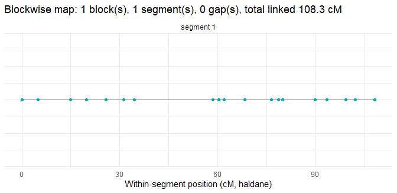

<!-- README.md is generated from README.Rmd. Please edit README.Rmd and re-knit. -->

# HSMap

<!-- badges: start -->

[](https://github.com/mmollina/HSMap/actions/workflows/R-CMD-check.yaml)
[](https://lifecycle.r-lib.org/articles/stages.html#maturing)
<!-- badges: end -->

**HSMap** builds maternal linkage maps from **open-pollinated /
unknown-sire diploid half-sib families**: one or more known dams, many
offspring, and unknown fathers. Transmission along an ordered marker set
is modelled with a fast C++ (Rcpp) **maternal hidden Markov model**. The
hidden state is which maternal homolog was transmitted, transitions
encode recombination between adjacent markers, and the unknown paternal
contribution is integrated out of the emissions through a per-marker,
**dam-specific paternal gametic frequency**. When several dams are
analysed together, HSMap estimates a **single shared recombination map**
by a joint EM while keeping phase and the paternal model dam-specific.

Because phase can be locally unresolved (dams are heterozygous at
different markers), the multipoint map is fitted **within resolved phase
blocks**, and intervals with no linkage (recombination fraction at 0.5)
are reported as **gaps** rather than as large centimorgan distances.

> **Scope.** This release covers the open-pollinated / unknown-sire
> method only. Experimental known-sire / full-sib support exists on a
> separate development branch; it is oracle-phase only and **not** part
> of this release or the accompanying paper.

## Installation

``` r
# install.packages("remotes")
remotes::install_github("mmollina/HSMap")
```

## Quick start

The workflow below runs on a small **simulated** example dataset shipped
with the package (no private files required). It covers reading data,
two-point analysis, filtering, grouping, ordering, dam-specific phasing,
blockwise multipoint mapping, safe map reporting, and plotting.

``` r
library(HSMap)
RcppParallel::setThreadOptions(numThreads = 2)

# 1. Read pedigree + genotype files (simulated example shipped with the package)
ped  <- system.file("extdata", "example_pedigree.csv",  package = "HSMap")
geno <- system.file("extdata", "example_genotypes.csv", package = "HSMap")
dat  <- read_HSMap_data(ped, geno)
dat
#> HSMap.data
#>   Markers     : 24 
#>   Populations : 3 
#>   Alleles     : 24 rows (marker_id, REF, ALT, chrom, position)
#> 
#> Per-population summary (first 6 rows):
#>   family_id mother_id n_offspring n_markers missing_rate maternal_het_rate
#> 1      MOM1      MOM1          60        24            0                 1
#> 2      MOM2      MOM2          50        24            0                 1
#> 3      MOM3      MOM3          45        24            0                 1

# 2. Two-point (pairwise) analysis: recombination fraction + phase LOD for every pair
tpt <- pairwise_rf(dat, threads = 2)

# 3. Filter the two-point table (drop weak / uninformative pairs)
tptf <- tpt_filter(tpt, diagnostic.plot = FALSE)

# 4. Group markers into linkage groups (k = 1 here: the example is one simulated
#    chromosome; use k = <n chromosomes> on real data)
grp <- group_markers(tptf, k = 1, inter = FALSE)

# 5. MDS ordering within each linkage group
ord <- mds_order(grp, tptf, plot_each = FALSE)
lg1 <- ord[[1]]                       # ordered marker IDs of the first linkage group

# 6. Dam-specific phase estimation (one coupling/repulsion configuration per dam)
ph <- phase_from_pairwise(tptf, order = lg1, dam = "all")

# 7. Blockwise multipoint HMM map: the joint EM is fitted WITHIN each resolved phase
#    block, so unresolved phase never forces an imputed map
blocks <- hmm_map_blocks(dat, ph)
blocks$n_blocks
#> [1] 1

# 8. Safe map positions and lengths: gaps (no-linkage / unresolved) are NA, never a
#    large finite cM distance
bm <- get_block_map(blocks, "haldane")
bm$total_linked_length                # finite linked cM summed across blocks
#> [1] 108.3117
table(bm$interval_table$status)       # per-interval linked / gap classification
#> 
#> linked 
#>     22
```

``` r
# 9. Plot phase blocks and map segments
plot_block_map(blocks, map.function = "haldane")
```



See `vignette("getting-started", package = "HSMap")` for a fuller
walk-through, including the single-dam map and per-offspring haplotype
probabilities.

## Citation

If you use HSMap, please cite it (see `citation("HSMap")`). A methods
paper is in preparation.

## License

MIT © the HSMap authors. See [LICENSE](LICENSE).
