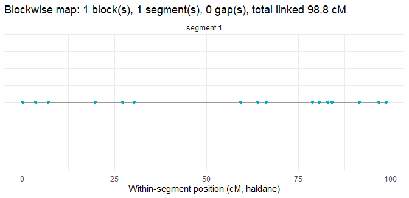

<!-- README.md is generated from README.Rmd. Please edit README.Rmd and re-knit. -->

# HSMap

<!-- badges: start -->

[](https://github.com/mmollina/HSMap/actions/workflows/R-CMD-check.yaml)
[](https://lifecycle.r-lib.org/articles/stages.html#maturing)
<!-- badges: end -->

**HSMap** builds a maternal linkage map from an **open-pollinated /
unknown-sire diploid half-sib family**: one known dam, many offspring,
and unknown fathers. Transmission along an ordered marker set is
modelled with a fast C++ (Rcpp) **maternal hidden Markov model**. The
hidden state is which maternal homolog was transmitted, transitions
encode recombination between adjacent markers, and the unknown paternal
contribution is integrated out of the emissions through a per-marker
**paternal gametic frequency**, estimated jointly with the recombination
map by EM.

Because a single dam is heterozygous at only a subset of markers, phase
can be locally unresolved; the multipoint map is fitted **within
resolved phase blocks**, and intervals with no linkage (recombination
fraction at 0.5) or unresolved phase are reported as **gaps** rather
than as large centimorgan distances.

> **Scope.** This release and its accompanying paper cover the
> **single-family** open-pollinated / unknown-sire method. Two
> extensions build directly on this core and are developed in a
> **companion paper (forthcoming)**; both are already included in the
> software but are *not* part of this paper:
>
> - **Multiple dams under one shared map** — a joint EM pools
>   recombination information across families (`hmm_map_joint()`,
>   `hmm_map_blocks()` on several dams, `test_map_heterogeneity()`).
> - **Known-sire / full-sib crosses** — a four-state model in which
>   paternal transmission is itself a linked hidden path
>   (`hmm_map_fullsib()`, `hmm_map_mixed()`, `sim_fullsib()`). This is
>   **oracle-phase only** and lives on a separate development branch;
>   its API may change without a deprecation cycle.

## Installation

``` r
# install.packages("remotes")
remotes::install_github("mmollina/HSMap")
```

## Quick start

The workflow below maps a **single family** on a small **simulated**
example dataset shipped with the package (no private files required). It
covers reading data, two-point analysis, filtering, grouping, ordering,
phasing, blockwise multipoint mapping, safe map reporting, and plotting.

``` r
library(HSMap)
RcppParallel::setThreadOptions(numThreads = 2)

# 1. Read pedigree + genotype files (simulated example shipped with the package)
ped  <- system.file("extdata", "example_pedigree.csv",  package = "HSMap")
geno <- system.file("extdata", "example_genotypes.csv", package = "HSMap")
dat  <- read_HSMap_data(ped, geno)
dat
#> HSMap.data
#>   Markers     : 24 
#>   Populations : 3 
#>   Alleles     : 24 rows (marker_id, REF, ALT, chrom, position)
#> 
#> Per-population summary (first 6 rows):
#>   family_id mother_id n_offspring n_markers missing_rate maternal_het_rate
#> 1      MOM1      MOM1          60        24            0                 1
#> 2      MOM2      MOM2          50        24            0                 1
#> 3      MOM3      MOM3          45        24            0                 1

# 2. Two-point (pairwise) analysis: recombination fraction + phase LOD for every pair
tpt <- pairwise_rf(dat, threads = 2)

# 3. Filter the two-point table (drop weak / uninformative pairs)
tptf <- tpt_filter(tpt, diagnostic.plot = FALSE)

# 4. Group markers into linkage groups (k = 1 here: the example is one simulated
#    chromosome; use k = <n chromosomes> on real data)
grp <- group_markers(tptf, k = 1, inter = FALSE)

# 5. MDS ordering within the linkage group
ord <- mds_order(grp, tptf, plot_each = FALSE)
lg1 <- ord[[1]]                       # ordered marker IDs of the first linkage group

# 6. Phase ONE family: dam = 1 returns a single coupling/repulsion configuration
ph <- phase_from_pairwise(tptf, order = lg1, dam = 1)

# 7. Blockwise multipoint HMM map for that family: the EM is fitted WITHIN each resolved
#    phase block, so unresolved phase never forces an imputed map
blocks <- hmm_map_blocks(dat, ph)
blocks$n_blocks
#> [1] 1

# 8. Safe map positions and lengths: gaps (no-linkage / unresolved) are NA, never a
#    large finite cM distance
bm <- get_block_map(blocks, "haldane")
bm$total_linked_length                # finite linked cM summed across blocks
#> [1] 98.77628
table(bm$interval_table$status)       # per-interval linked / gap classification
#> 
#> linked 
#>     22
```

``` r
# 9. Plot phase blocks and map segments
plot_block_map(blocks, map.function = "haldane")
```



See `vignette("getting-started", package = "HSMap")` for a fuller
walk-through, including per-offspring haplotype probabilities and the
forthcoming multi-dam extension (`phase_from_pairwise(..., dam = "all")`
followed by a joint `hmm_map_blocks()` fit).

## Citation

If you use HSMap, please cite it (see `citation("HSMap")`). The
single-family methods paper is in preparation; the multi-dam and
known-sire extensions are described in a companion paper (forthcoming).

## License

MIT © the HSMap authors. See [LICENSE](LICENSE).
